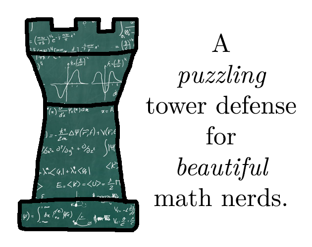

# A puzzling tower defense for beautiful math nerds.

A math-themed tower defense game written in C and [raylib](https://www.raylib.com/) for the [GMTK Jam 2024](https://itch.io/jam/gmtk-2024).

You can play the game in your browser here: https://foxblock.itch.io/math-td

## Building
### Windows
- Install any [Visual Studio version with the "Desktop development with C++" workload](https://visualstudio.microsoft.com/de/downloads/) OR just the [Microsoft C/C++ Build Tools](https://aka.ms/vs/17/release/vs_BuildTools.exe)
- clone the repo and cd into folder
- run `build_msvc.bat` > creates build folder and exe inside
  - you can pass the following options to the script: debug, run
  - like `build_msvc.bat debug run`

### Linux
- you are on your own for now, sorry
- `gcc -o build\mathtd src\main.c -Iinclude -Isrc -Llib\libraylib.a` might work (you will have to supply the libraylib.a)

### Web
- (Linux and WSL only for now, because I could not get emsdk working on Windows directly)
- this guide assumes you have raylib cloned next to this repo on your disk
- follow this guide (until the steps compiling the raylib examples) to intall emscripten SDK and setup raylib: https://stackoverflow.com/a/70640781
- you should have a libraylib.a file in the raylib/src folder
- cd back to this repository
- run `build_web.sh` from this folder